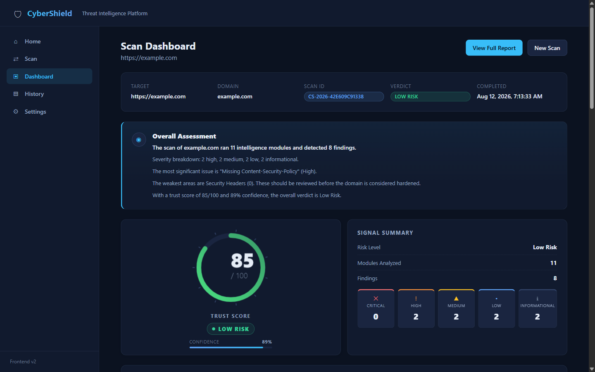
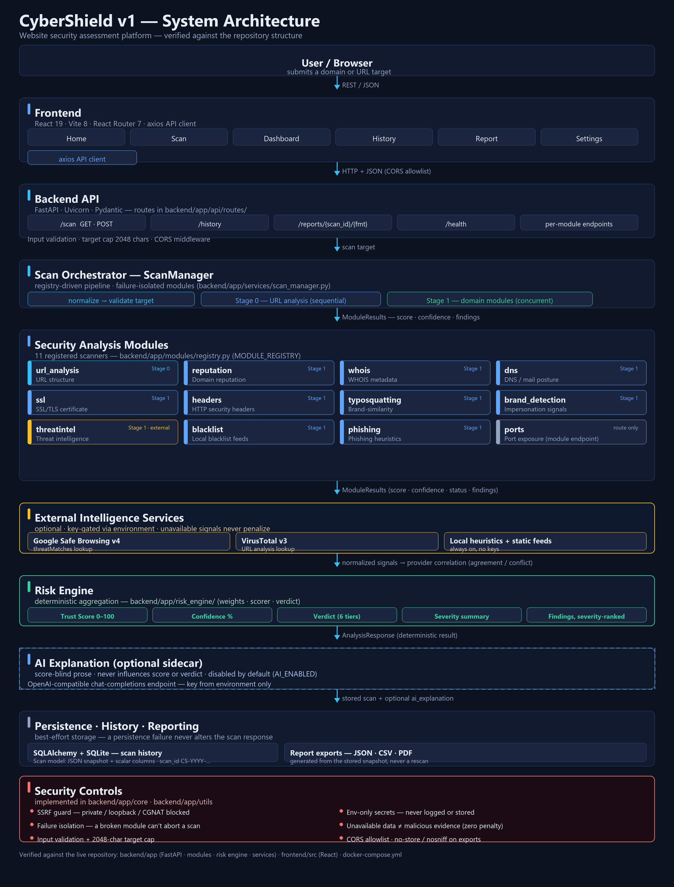
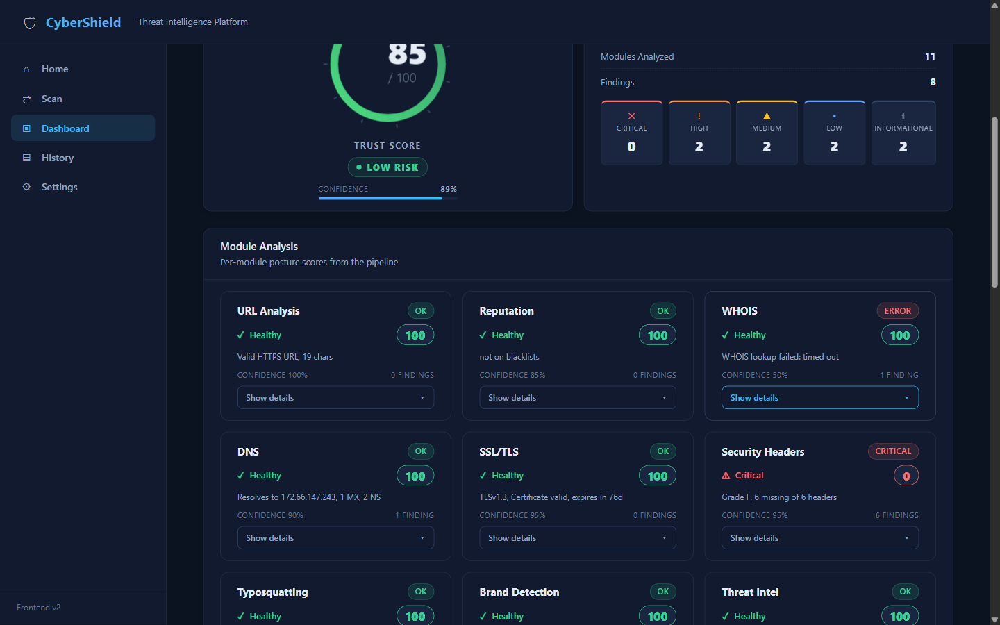
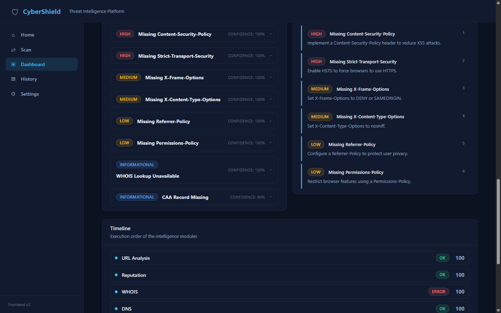
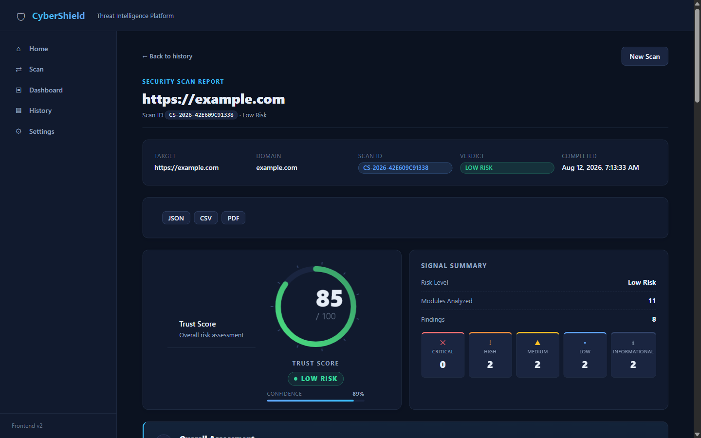

# CyberShield

[](LICENSE)
[](backend)
[](backend)
[](frontend)
[](docker-compose.yml)

CyberShield is a full-stack website security assessment platform. Submit a domain or URL, and a pipeline of detection modules collects evidence across URL structure, DNS, WHOIS, SSL/TLS, security headers, reputation, blacklists, phishing heuristics, typosquatting and threat intelligence — then aggregates it into an explainable **Trust Score**, **verdict**, **confidence** and severity-ranked **findings** with recommendations.

Every result is deterministic and evidence-based: the Risk Engine owns the score, each finding carries a severity, a plain-language description and a recommendation, and an optional AI layer explains *why* the result was reached without ever influencing it.



> A genuine scan of `https://example.com` captured through the live application: Trust Score **85/100**, verdict **Low Risk**, confidence **89%**.

---

## Quick Start

The simplest verified way to run CyberShield:

```sh
docker compose up --build
# open http://localhost
```

No API keys are required. Without external provider credentials the platform runs on local heuristics and static feeds. Full local-development steps are in [Installation](#installation).

---

## The Problem

Most web users cannot tell a legitimate site from a phishing clone, a typosquatting domain, or a recently registered domain set up for abuse. Manually checking a URL means consulting WHOIS registries, DNS records, certificate details, blacklists and threat-intelligence feeds **separately** — then deciding how much any single signal should matter.

CyberShield replaces that manual process with one scan that inspects the URL's structure, interrogates the domain's DNS/WHOIS/SSL/TLS and HTTP security headers, checks reputation and heuristics, correlates optional external threat-intelligence providers, and feeds every signal into a deterministic Risk Engine that produces the Trust Score, verdict and confidence.

CyberShield is a **defensive assessment platform**, not an attack tool. It performs passive lookups only, and unavailable data (for example a failed WHOIS lookup) is never treated as evidence of maliciousness.

---

## Security Design

The strongest security engineering decisions:

| Control | Implementation |
| --- | --- |
| SSRF protection | Target hosts are resolved and refused if private, loopback, link-local, reserved, multicast, CGNAT or well-known private hostnames before any connection (`backend/app/utils/networking.py`) |
| Environment-only secrets | API keys are read from the environment, never hard-coded, persisted or logged; failures log exception *classes*, not payloads (`backend/app/core/config.py`) |
| Outbound request controls | External calls never retry, provider penalties are capped, and report downloads set `nosniff` + `no-store` headers |
| Failure isolation | A failing module or storage write degrades to an error/unavailable signal and cannot change the scan result the user receives |
| Unavailable ≠ malicious | Provider and WHOIS failures become informational signals with zero penalty — missing evidence is never treated as bad evidence |
| Deterministic scoring | The Risk Engine is a pure deterministic function of module results — the AI layer never influences it |

---

## How It Works



A scan flows through a registry-driven pipeline:

1. **Validate** the target — invalid URLs are rejected up front and never scanned by domain modules.
2. **Scan concurrently** — 11 registered modules collect evidence: URL structure, DNS, WHOIS, SSL/TLS, HTTP security headers, reputation, blacklists, phishing heuristics, typosquatting, brand detection and threat intelligence.
3. **Correlate threat intelligence** — provider adapters (Google Safe Browsing, VirusTotal) reconcile only among *available* providers.
4. **Score deterministically** — the Risk Engine produces the 0–100 Trust Score, confidence and verdict.
5. **Explain (optional)** — a score-blind AI summary explains the result; its failure never breaks a scan.
6. **Persist and report** — every scan is stored by ID and exportable as JSON, CSV or PDF.

---

## Key Features

| Area | What it does |
| --- | --- |
| URL / domain analysis | URL structure, DNS posture, WHOIS age and registrar, SSL/TLS, HTTP security headers |
| Deterministic Risk Engine | Weighted aggregation into Trust Score, confidence and verdict (see below) |
| Explainable findings | Severity-ranked findings, each with a description and a recommendation |
| Threat intelligence | Local heuristics always run; Google Safe Browsing v4 and VirusTotal v3 adapters when keys are configured |
| Multi-provider correlation | Agreement/conflict reconciliation computed only among available providers |
| Optional AI explanation | Score-blind plain-language summary, disabled by default |
| History / persistence | Every scan stored and retrievable by scan ID |
| Reporting | JSON, CSV and PDF export from the stored snapshot |
| Deployment | Docker Compose (backend + frontend images) |
| Automated testing | 278 backend tests, all passing; frontend lint and build verified |

---

## Risk Engine

The Risk Engine (`backend/app/risk_engine/`) is the deterministic aggregation layer:

- Each module returns a 0–100 score, confidence and findings.
- Module scores are combined with configured weights, re-normalized over the modules that actually produced results.
- A module that errors out contributes at reduced weight (`ERROR_CONFIDENCE_PENALTY = 0.5`), so a broken module can neither drag nor inflate a result.
- Confidence is the weighted average of module confidences with the same error discounting.

| Trust Score | Verdict |
| --- | --- |
| 90–100 | Trusted |
| 75–89 | Low Risk |
| 60–74 | Moderate Risk |
| 45–59 | Suspicious |
| 25–44 | High Risk |
| 0–24 | Critical |

Design principle: a **failure to obtain evidence is never evidence of maliciousness**. An unavailable WHOIS lookup yields an informational finding and zero penalty; it never becomes a security finding.

The optional AI layer **does not control the score** — it explains an already-computed result.

---

## Results

All screenshots below were captured from the live application running a real scan of `https://example.com` — no mock data.



The assessment result view: overall narrative, per-severity signal counts and module posture scores.



Severity-ranked findings with plain-language descriptions and recommendations.



The persisted report view with JSON / CSV / PDF export controls.

---

## Threat Intelligence & AI

- **Provider adapters** — Google Safe Browsing v4 (`threatMatches`) and VirusTotal v3 (URL analysis) are used only when their API keys are set.
- **Multi-provider correlation** — agreement is `consistent` / `partial` / `conflict` / `none`, computed only among *available* providers; an unavailable provider never counts as a dissenting vote.
- **Confidence/agreement signals** — aggregated confidence starts from the strongest flagging signal, adds a bonus per extra agreeing provider, and dampens on conflict.
- **Optional AI explanation** — requires `AI_ENABLED=true` and an OpenAI-compatible chat-completions endpoint. It is **disabled by default** in a fresh installation.
- **AI is score-blind** — the model receives no Trust Score, verdict or confidence, and its output is schema-validated before storage or display.
- **AI failure cannot break a scan** — disabled, unconfigured, timed out or malformed output degrades gracefully to `ai_explanation: null` with an unchanged result.

---

## Tech Stack

| Layer | Technology |
| --- | --- |
| Backend | Python 3.11+ · FastAPI · Uvicorn · Pydantic |
| Scanning | python-whois · dnspython · cryptography · httpx · requests |
| Persistence | SQLAlchemy · SQLite (PostgreSQL-compatible URL format) |
| Frontend | React 19 · Vite 8 · React Router 7 · axios |
| Testing | pytest · pytest-asyncio · pytest-cov · ESLint |
| External providers | Google Safe Browsing v4 · VirusTotal v3 · OpenAI-compatible chat endpoint (all optional) |
| Deployment | Docker Compose |

---

## Testing

Verified against the current implementation:

| Check | Result |
| --- | --- |
| Backend pytest suite | **278 passed** (`cd backend && ..\.venv\Scripts\python.exe -m pytest`) |
| Frontend lint | `cd frontend && npm run lint` → clean |
| Frontend build | `cd frontend && npm run build` → successful |
| Dependency health | `pip check` → no broken requirements |
| Real-user walkthrough | 4/4 cases passed against the live API and built frontend during release preparation |

Tests exercise the modules, pipeline, risk engine, threat-intel adapters and correlation with injected mocks — no network or real API keys are required. The deterministic result is asserted byte-identical with AI on, off, or failing.

---

## Installation

### Docker (recommended)

```sh
docker compose up --build
# open http://localhost
```

SQLite data persists on the host in `./data/cybershield.db`. To configure optional provider/AI keys, copy `backend/.env.example` to `backend/.env` before starting.

### Local development

```sh
# 1. Backend environment
python -m venv .venv

# Windows
.venv\Scripts\python.exe -m pip install -r backend\requirements.txt
# macOS / Linux
.venv/bin/python -m pip install -r backend/requirements.txt

# 2. Frontend dependencies
cd frontend && npm install

# 3. Start the backend (http://localhost:8000)
cd backend && ..\.venv\Scripts\python.exe -m uvicorn app.main:app --reload --port 8000

# 4. Start the frontend (http://localhost:5173)
cd frontend && npm run dev
```

No variables are *required* to run a scan. Without provider keys, CyberShield runs on local heuristics and static feeds; without `AI_ENABLED=true` and a key, no AI explanation is produced.

---

## Environment / API

All configuration is read from the environment — never hard-coded, logged or stored. See `backend/.env.example` and `backend/app/core/config.py` for the full reference.

| Variable | Default | Purpose |
| --- | --- | --- |
| `GOOGLE_SAFE_BROWSING_API_KEY` | *(empty)* | Enables the Safe Browsing provider when set |
| `VIRUS_TOTAL_API_KEY` | *(empty)* | Enables the VirusTotal provider when set |
| `AI_ENABLED` | `false` | Master switch for the optional explanation layer |
| `AI_API_KEY` / `AI_BASE_URL` / `AI_MODEL` | *(empty)* / `https://api.openai.com/v1` / `gpt-4o-mini` | OpenAI-compatible endpoint configuration |
| `CYBERSHIELD_DATABASE_URL` | `sqlite:///cybershield.db` | SQLAlchemy database URL |
| `CYBERSHIELD_CORS_ORIGINS` | local Vite dev origins | Allowed browser origins (never `*` in production) |

Key endpoints:

| Method | Path | Purpose |
| --- | --- | --- |
| GET | `/scan/{target}` · POST `/scan` | Full scan of a URL/domain |
| GET | `/history` · `/history/{scan_id}` | List and retrieve stored scans |
| GET | `/reports/{scan_id}/{fmt}` | Export report (`json`, `csv`, `pdf`) |
| GET | `/health` | Service health check |

Plus one endpoint per analysis module (`/dns/{domain}`, `/whois/{domain}`, `/ssl/{domain}`, `/headers/{domain}`, `/reputation/{domain}`, `/typosquatting/{domain}`, `/brand-detection/{domain}`, `/threatintel/{domain}`, `/url-analysis/{url}`). Scan targets are capped at 2048 characters; exports are generated from the stored snapshot — never by rescanning.

---

## Limitations

- **External providers require keys and availability.** Without keys, threat-intel runs on local heuristics only; VirusTotal free-tier limits apply (≈4 req/min, 500 req/day — one request per scan, no retries).
- **AI is opt-in.** It is a third-party dependency, disabled by default, and strictly presentational.
- **Heuristic scope.** Reputation, phishing, typosquatting and blacklist checks detect known signals, not all possible threats.
- **WHOIS availability varies by registry.** An unavailable lookup is treated as informational, not suspicious.
- **Single-user, no authentication.** CyberShield runs as a local/portfolio deployment, not a multi-tenant SaaS.
- **No automated CI pipeline yet.** Containerized runtime is verified locally; image builds and runtime checks are not yet CI-gated.
- **Frontend dependency audit finding.** `npm audit` reports one pre-existing high-severity vulnerability in the frontend dependency tree — tracked as a security-maintenance follow-up, with no arbitrary package upgrades.

---

## Roadmap

### v1 — Released

Full assessment pipeline, 11 modules, deterministic Risk Engine, threat-intelligence correlation, optional AI explanations, history/persistence, JSON/CSV/PDF reports, React frontend, 278-test backend suite, Docker Compose deployment.

### v1.1+ — Future work

Not yet implemented:

- Additional threat-intelligence providers beyond Safe Browsing and VirusTotal
- Scheduled / recurring monitoring with alerting
- Historical risk comparison and trend views
- User accounts and authentication
- Deeper phishing model (e.g. ML-assisted heuristics)
- Enhanced correlation (provenance-tagged confidence)
- CI pipeline with coverage gates and containerized runtime verification

A design document for v1.1 infrastructure-location enrichment (ASN, hosting organization, country/region intelligence) exists as future work and is **not** implemented functionality in v1.

---

## License

MIT — see [LICENSE](LICENSE).

---

## Documentation

- `backend/README.md` — deep backend technical reference (modules, scoring, providers)
- `docs/architecture.md` — architecture reference
- `docs/demo-walkthrough.md` — step-by-step demo walkthrough